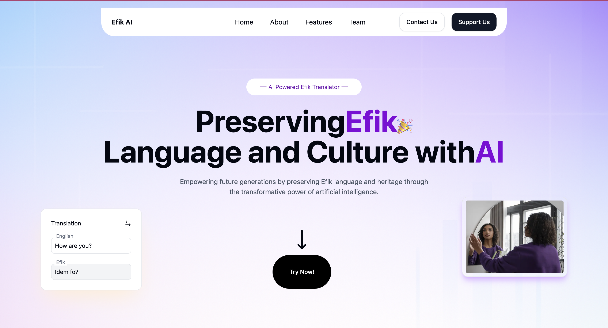

# EfikNLP-Machine-Translation-Text-to-Speech
Building the first publicly available Machine Translation and Text-to-Speech system for the Efik language.

# 1. Project Overview
EfikNLP is a grassroots initiative to build the first publicly available, open-source Machine Translation (MT) and Text-to-Speech (TTS) system for the Efik language, spoken by millions in Nigeria and Cameroon. This project aims to bridge the digital language, empower Efik speakers with accessible technology, and create foundational tools for educational, cultural, and economic development.

# 2. Problem Statement
The Efik language, spoken by over 7 million people in Nigeria and Cameroon, faces digital extinction due to the absence of foundational Natural Language Processing (NLP) tools. This creates significant barriers:

- No Public Translation Tools: Efik speakers cannot access digital content or services in their native language.
- No Speech Technology: Limits accessibility for visually impaired communities and hinders development of educational audio content.
- Cultural Erosion: The language is being excluded from the digital revolution, threatening its preservation for future generations.

# 3. Motivation
This groundbreaking work directly beneftis the 7+ million speakers by enabling digital communication, literacy support, and content localization. The Project aligns with Masakhane's goal of strengthening African languages using community-driven NLP. It totaly fills a major gap in existing resources and creates a foundation for future research including ASR, chatbots, education tools, and preservation.

# 4. Project Vision
To build the first publicly available, open-source Machine Translation (MT) and Text-to-Speech (TTS) system for the Efik language, creating foundational digital infrastructure that will:

- Empower Efik speakers with accessible technology
- Enable educational and economic opportunities
- Preserve cultural heritage for future generations
- Serve as a blueprint for other low-resource African languages

# 5. Current Progress & Achievements

## 5.1 Machine Translation (MT)

- **Community-curated parallel corpus:** 13,865 sentence pairs from daily conversations, stories, and real-life contexts.
- **Dataset expansion:** Increasing to **20,000–21,000** via linguist-driven handwritten translations (7,800 new sentences).  
  These are currently being typed, cleaned, normalized, and validated.
- **Model architecture:** Fine-tuned **mT5-small** using **LoRA**, trained on Google Colab.
- **Evaluation Results:**
  - **BLEU:** 15.61  
  - **chrF:** 35.04  
- **Human Evaluation:** Conducted with linguists and native speakers.  
  Judged **fluent**, **accurate**, and **culturally appropriate**.
- **Data Quality Pipeline Improvements:**
  - Text normalization  
  - Diacritic restoration  
  - Deduplication  
  - Linguistic error correction  
  - Structured JSON / TSV dataset formatting  
  - Sentence-level alignment checks

**Outcome:**  
A functional Efik ↔ English MT prototype with strong validation.  
Performance expected to improve significantly as the dataset grows to **50K+ pairs** with additional funding.

---

## 5.2 Text-to-Speech (TTS)

- **Collected:** ~10 hours of native Efik speech (self-recorded with wireless microphone).
- **Prepared:** 2 hours 28 minutes cleaned, segmented, and labeled for training.
- **Model architecture:** Fine-tuned **VITS** (non-autoregressive).
- **Training:** 70 epochs on Google Colab (free GPU).
- **Observations:**  
  Output is intelligible but limited due to:
  - Short training duration  
  - Insufficient quantity of high-quality labeled audio  
- **Current Work:**  
  Labeling and preprocessing remaining recordings to reach **8–10 hours** of clean data.
- **Next Phase Goals:**  
  Re-train the TTS model for **500+ epochs**, integrate phoneme-level normalization, and build a higher-quality Efik voice model.

**Outcome:**  
The dataset and pipeline are solid; TTS quality will drastically improve as we scale to **30 hours** of speech with future funding.

---

## 5.3 Community Engagement

**Active consultation with:**

- Native Efik speakers
- Linguists from University of Calabar
- Lecturers (CRUTECH/UNICAL)
- Ethical guidelines established
- Cultural authenticity validated

---

# 6. Future Scale With Funding
Funding will directly accelerate Efik NLP development, enabling large-scale data creation and high-performance models for both Machine Translation (MT) and Text-to-Speech (TTS).

---

## 6.1📘 Machine Translation (MT) – Corpus Expansion
**Goal with Funding:**
➡️ Expand the Efik–English parallel corpus from **20K** to **50,000+ high-quality, human-verified sentence pairs**.

**How We Will Achieve This**
We will build a **domain-balanced, professionally validated** dataset by:
- Recruiting **6-10 trained linguists & native speakers**
- Providing structured translation batches
- Creating diverse domain coverage, including:
    - health
    - education
    - conversation
    - news
    - fiction & literature
    - children stories
    - cultural narratives
    - product reviews

- Implementing a **2-pass verification system:**
    1. Linguistic correctness & diacritic accuracy
    2. Semantic validation by senior reviewers

---

**MT Model Impact:**
- Enable training of mT5-base, NLLB, and domain-specific MT models
- Drastically improve translation fluency and accuracy
-   **Target Performance:**
    -   BLEU: 25–35+
    -   Significant gains in chrF & human evaluation
    -   Support downstream applications:
        -   Educational tools
        -   Healthcare communication aids
        -   Government information accessibility
        -   Summarization, QA, ASR → MT pipelines, etc.
---

## 6.2 TTS (Speech) – Large-Scale Dataset Expansion
**Goal with Funding:**

Grow the Efik speech dataset from the current **8–10 hours → 30+ hours** of high-quality native speech.
**How We Will Achieve This**
-   Hire multiple native speakers (male and female)
-   Record diverse reading materials:
    -   conversational
    -   news
    -   educational text
    -   Bible passages
    -   stories
    -   Poems & expressive readings
-   Use semi-professional or studio-quality setups
-   Apply advanced preprocessing:
    -   Noise reduction
    -   Volume normalization
    -   Forced alignment + manual correction
-   Produce text–audio alignments for all recordings

**TTS Model Impact**
-   Fine-tune a pretrained **VITS model** using the expanded 50+ hour dataset.
-   Add:
    -   Multi-speaker support
    -   Speaker embedding
    -   Prosody control
-   Achieve near-commercial quality:
    -   **MOS 4.2+** (human-like naturalness)
    -   Clearer pronunciation
    -   Better stability & prosody
-   Release an open, community-driven Efik TTS dataset comparable to:
    -   LJSpeech (24h)
    -   Common Voice contributions

---

## 6.3 Revised Deliverables
With Funding, the Team Will Deliver:
**1. Data Resources**
-   **100,000+ MT sentence pairs**
-   **100+ hours of Efik speech audio**
-   Text–audio alignments
-   Phoneme dictionary & pronunciation guide
-   Clean, open-source dataset releases

2. **Models**
-   **Efik MT v2.0**
    -   Trained on 50K corpus
    -   Target BLEU: 25–35+
    -   Released on HuggingFace
-   **Efik TTS v2.0**
    -   Trained on 30+ hours
    -   Near-human quality
    -   Multi-speaker + expressive prosody

3. **Tools & Resources**
-   Web demo for MT & TTS
-   API endpoints for developers
-   Tutorials, notebooks, data documentation

---

## 6.4 Budget: $750 USD

| Category                  | Amount | Justification                                                                                  |
|---------------------------|--------|-----------------------------------------------------------------------------------------------|
| Cloud Computing           | $160   | GPU compute hours for training & fine-tuning MT and TTS models (mT5, VITS, alignment tools) |
| Data Curation             | $470   | Compensation for native Efik speakers for translations, audio recordings, and validation     |
| Documentation & Dissemination | $100 | Website hosting, dataset preparation, reports, and public release materials                  |
| **Total**                 | **$730** |                                                                                               |

---

## 6.5 Project Timeline (4 Months)

**Phase 1 — Month 1: Data Collection & Initial Validation**
- Handwritten translations by linguists
- Begin typing, correcting, and validating MT translations
- Start large-scale audio collection and preliminary cleaning

**Phase 2 — Month 2: Data Cleaning & Preprocessing**
- Complete typing and corrections of translations
- Normalize, deduplicate, and clean MT dataset
- Continue TTS audio preprocessing, segmentation, and labeling
- Prepare text-audio alignments and metadata

**Phase 3 — Month 3: Model Training & Evaluation**
- Train initial MT models (mT5-small / mT5-base)
- Evaluate MT outputs with linguists (fluency, adequacy, cultural accuracy)
- Begin TTS training (VITS) on labeled audio
- Conduct iterative human evaluation rounds

**Phase 4 — Month 4: Final Release & Community Impact**
- Release Efik MT Model (trained on internal dataset)
- Pretrained VITS Efik TTS model (30+ hours)
- Publish documentation, HuggingFace models, demo website
- Community dissemination, workshops, and presentations

---

# 7. Community Engagement
We will collaborate with native Efik speakers and linguists to validate translations, record audio, and ensure cultural accuracy. Researchers and developers will contribute to dataset formatting, model optimization, and documentation. We also aim to share findings widely to raise awareness and encourage further participation in African language NLP.

---

# 8. Website

We have already deployed a beta verson of the initial project website, which will host the public demos and documentation:

**➡️ https://efik-ai.vercel.app**

**With additional funding, we will complete the full deployment pipeline:**
-   Publish all datasets to Hugging Face
-   Retrain MT and TTS models on the expanded data
-   Deploy inference APIs using FastAPI
-   Build a user-friendly frontend in Next.js for translation and TTS demos
-   Provide endpoints for developers, researchers, and educators

This ensures full accessibility and long-term sustainability of the models.

---

# 9. Long-Term Impact

With funding, this project will scale into the largest digital resource ever created for the Efik language, including:

-   **50,000+ parallel Machine Translation sentences**
    -   Covering domains such as:
        -   health
        -   education
        -   daily conversation
        -   news
        -   fiction and cultural stories
        -   product reviews

-   **30+ hours of annotated Efik speech**
    -   Suitable for:
        -   high-quality VITS training
        -   expressive TTS
        -   future ASR development

- **This investment creates:**
    -   strong digital infrastructure for Efik NLP
    -   accessible tools for schools, communities, and cultural institutions
    -   improved accessibility for visually impaired users
    -   a foundation for future systems such as ASR, chatbots, educational apps, and digital archiving

This project doesn’t only build models — it preserves and empowers a language spoken by millions in Nigeria and Cameroon.

---

# 10. Contributors
1. **Offiong Bassey**

    
    Fullstack engineer and NLP researcher building the first English↔Efik MT system. Leads MT and TTS development, collaborating with linguists and researchers to create foundational Efik digital tools.

    **Role:** ML Engineer, Researcher, Native Speaker, Translator.

    **LinkedIn:** https://www.linkedin.com/in/offiong-bassey-dev
    ---

2. **Benjamin Nyong**
    
    Efik linguist and language consultant contributing expertise in lexical accuracy, cultural authenticity, and language preservation for MT and TTS datasets.

    **Role:** Linguist, Translator, Researcher

    **LinkedIn:** https://www.linkedin.com/in/benjamin-nyong-966086166

    **Google Scholar:** https://scholar.google.com/citations?user=_PqwvNYAAAAJ&hl=en
    ---

3. **Ita Bassey**
    
    Native Efik speaker and linguist providing accurate translations, phonetic guidance, and cultural context for MT and TTS datasets.

    **Role:** Linguist, Translator, Native Speaker
    ---

4. **Mbuotidem Awak**
    
    Data analyst and NLP Researcher.
    
    **Role:** Researcher and Analyst

    **LinkedIn:** https://www.linkedin.com/in/mbuotidem 
    ---

5. **Archibong Archibong**
    
    Native Efik speaker contributing translations and phonetic corrections for high-quality MT and TTS outputs.

    **Role:** Translator, Native Speaker

    **LinkedIn:** https://www.linkedin.com/in/archibong-archibong-b59428193 

6. **Andrew Nkpanem**
    
    Native Efik speaker and translator, ensuring natural fluency and cultural authenticity in both MT and TTS corpora.

    **Role:** Translator, Native Speaker
    ---

---

# 11.📬 Contact

Offiong Bassey
📧 offiongbassey99@gmail.com